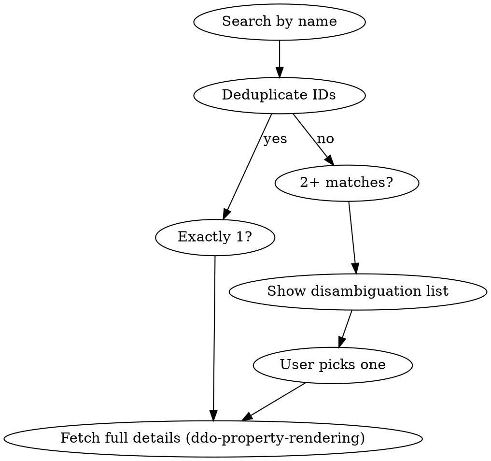

# DDO Name Lookup

Look up game objects by name, disambiguate when multiple matches exist, then show full details.

## Flow

## Steps

1. **Search**: `curl -s "http://localhost:5138/DbProperties/IdsForName?name=<term>"`
   - Returns an array of integer IDs (may contain duplicates). Deduplicate them.

2. **Single result**: Fetch with `ddo-property-rendering` skill and show full details.

3. **Multiple results**: Show a disambiguation list. For each of the first 5 unique IDs, fetch `http://localhost:5138/DbProperties/<id>` and extract only:
   - **Name**: property with `"name": "Name"` — its `value` (String)
   - **Type**: property with `"name": "WeenieType"` — its `enumValue` (Enum)
   - **Description**: property with `"name": "Item_Description"` — its `value` (StringInfo)

   Group results by category (e.g., all Missiles together, all Spells together, all Effects together). Present as a numbered list showing each object's `propertyCollectionId` in hex. If more than 5 unique IDs, add a "Show more" option. Stop and wait for the user to pick one.
