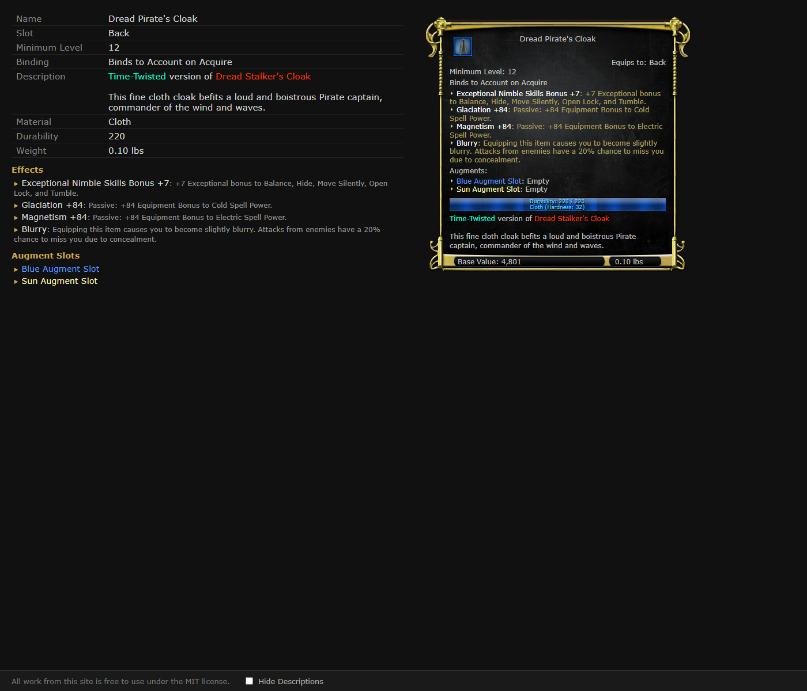

# DDO Dat Reader API

An AI-powered tool for exploring [Dungeons & Dragons Online](https://www.ddo.com/) game data. Ask questions about items, spells, NPCs, quests, enhancement trees, loot tables, and more — and get answers pulled directly from the game's client files.

Under the hood, a .NET web API reads DDO's `.dat` files and exposes them over HTTP. An MCP (Model Context Protocol) bridge connects the API to Claude Code (or any MCP-compatible AI agent), so you can query game data conversationally instead of digging through raw files. The API also includes a built-in **item viewer** that renders DDO-style item tooltip panels in the browser.

## What It Does

The API loads DDO's client dat files (gamelogic, general, sound, local_English, surfaces, animations, cells, maps, meshes, and highres textures) and exposes their contents over HTTP. It provides endpoints for:

- **DbProperties** — parsed property collections from `client_gamelogic.dat`, with name-based lookups, weenie type browsing, enhancement trees, and treasure tables
- **EntityDesc** — EntityDesc objects from `client_gamelogic.dat`
- **Images** — extract and serve PNG images from the dat files, including composite item icons
- **Sounds** — sound metadata from `client_general.dat`
- **Recipes** — look up crafting recipes by ingredient item
- **Raw dat access** — read raw binary objects from any dat file by ID
- **ID ranges** — list the known object type ID ranges
- **Cache management** — rebuild the gamelogic index, check cache status, or download the full index
- **Item viewer** — browser-rendered item pages with a DDO tooltip mock panel

## Prerequisites

- **DDO installed** — a local installation of Dungeons & Dragons Online (the API reads directly from the game's `.dat` files)
- [.NET 10 SDK](https://dotnet.microsoft.com/download/dotnet/10.0)
- **Git Bash or compatible shell** — `run.sh` uses bash and the Windows `reg` command to locate the DDO install path
- **Node.js** — for the OpenAPI-to-MCP bridge
- **Claude Code** — AI agent CLI
  ```
  npm install -g @anthropic-ai/claude-code
  ```

For Docker mode (`./run.sh --docker`), you also need **Docker Desktop**.

## Quick Start

Clone the repo and run the setup script:

```bash
git clone https://github.com/morrikan/ddo-dat-api.git
cd ddo-dat-api
./run.sh
```

### What `run.sh` Does

1. Queries the Windows registry to find your DDO installation directory
2. Builds and runs the API via `dotnet run` (or Docker with `--docker`)
3. Waits for the API to become available
4. Saves the OpenAPI schema and sets up the MCP server for Claude
5. Opens Swagger UI and launches Claude Code

If the registry lookup fails (e.g. non-standard install location), set `INSTALL_PATH` manually in `run.sh` or in `DatSource.cs`.

Once running, the API is available at `http://localhost:5138` and the Swagger UI at `http://localhost:5138/swagger`.

## Performance Note

> Index generation typically completes in **3-4 minutes** when running locally. **In Docker mode, it can take over 30 minutes** due to volume mount overhead.

The index is saved to disk as `indexcache.json` and loaded automatically on subsequent startups, so this cost is only paid once (or after a game patch). You can trigger a rebuild at any time via `POST /Cache/Rebuild`.

## API Endpoints

| Endpoint | Method | Description |
|---|---|---|
| `/DbProperties/{id}` | GET | Get a parsed property collection by ID |
| `/DbProperties/IdsForName?name=` | GET | Look up object IDs by name |
| `/DbProperties/WeenieTypeCounts` | GET | Get counts of each weenie type |
| `/DbProperties/ByWeenieType/{weenieType}` | GET | List objects of a given weenie type |
| `/DbProperties/EnhancementTrees` | GET | List all enhancement trees |
| `/DbProperties/TreasureTables` | GET | List all treasure table IDs |
| `/DbProperties/Search` | POST | Search objects by keyword/regex patterns |
| `/Strings/{table}/{key}` | GET | Look up a localized string by table and key ID |
| `/Set/{setId}` | GET | Get a set bonus entry by SetBonus_ID |
| `/EntityDesc/{id}` | GET | Get an EntityDesc object by ID |
| `/Image/{id}` | GET | Get a PNG image by ID |
| `/Image/Icon/{id}` | GET | Get the composite item icon (underlayer + background + magic border + item icon) |
| `/Recipe/ForItem/{id}` | GET | Get all crafting recipes that use an item as an ingredient |
| `/Sound/{id}` | GET | Get sound metadata by ID |
| `/RawDat/{dat}/{id}` | GET | Read raw bytes from a specific dat file |
| `/RawDat/IdRanges` | GET | List known object type ID ranges |
| `/Cache/Rebuild` | POST | Trigger a full cache/index rebuild |
| `/Cache/Metadata` | GET | Get index timestamp, version, and size |
| `/Cache/Download` | GET | Download the full index |
| `/Item/id/{id}` | GET | Render an item page in the browser (see below) |

IDs can be provided in hexadecimal (prefixed with `0x`) or as plain integers.

## Item Viewer

`GET /Item/id/{id}` renders a browser page for any equippable item. The page has two columns:

- **Left** — a structured field/value table listing name, type, stats, binding, effects, augment slots, set bonuses, recipes, and more
- **Right** — a DDO-style tooltip mock panel that mirrors the in-game examine window, including the item icon, damage/armor stats, effect list, augment slots, and durability footer

Supported item types:

| Type | Notes |
|---|---|
| Weapons | Damage line, crit roll, attack/damage ability mods, handedness, enhancement bonus |
| Shields | Shield bonus, max dex bonus, DR, armor check penalty, spell failure, shield-bash damage |
| Armor | Armor bonus, max dex bonus, armor check penalty, spell failure |
| Jewelry / Clothing | Slot identification (ring, neck, trinket, cloak, etc.) |
| Augments | Augment type, equipped effects, set bonuses (filigrees) |

All types show: minimum level, binding, clickie spells (with icon, caster level, charges, recharge), effects, augment slots, set bonuses, material, durability, weight, and recipes.



Example: `http://localhost:5138/Item/id/0x7902F2C7`

## Project Structure

```
ddo-dat-api/
├── run.sh                # Setup script (registry lookup, build, MCP setup, launch Claude)
├── render-panel.mjs      # Puppeteer script for screenshot testing the item viewer panel
├── CLAUDE.md             # AI agent instructions and property display rules
├── .claude/skills/       # AI workflow skills (name lookup, property rendering, etc.)
└── src/DdoDatApi/
    ├── dockerfile        # Multi-stage .NET 10 build (for --docker mode)
    ├── Program.cs        # App entry point, Swagger config
    ├── DatSource.cs      # Loads all dat files via VoK.Sdk
    ├── Controllers/      # API endpoints + EffectResolver (effect instantiation logic)
    ├── Caching/          # Index builder (IndexLoader) and static cache holder (DatCache)
    ├── Converters/       # JSON property converters
    ├── Models/           # DTOs and view models
    └── Views/Item/       # Razor view for the item viewer page
```

### `render-panel.mjs`

A Puppeteer script that navigates to an item page and saves a screenshot of the mock panel to `temp/render-{id}.png`. Useful for visually verifying the tooltip panel during development.

```bash
node render-panel.mjs <item-id>
# e.g. node render-panel.mjs 0x7902F2C7
```

## License

This project is not affiliated with or endorsed by Standing Stone Games or Daybreak Game Company.
